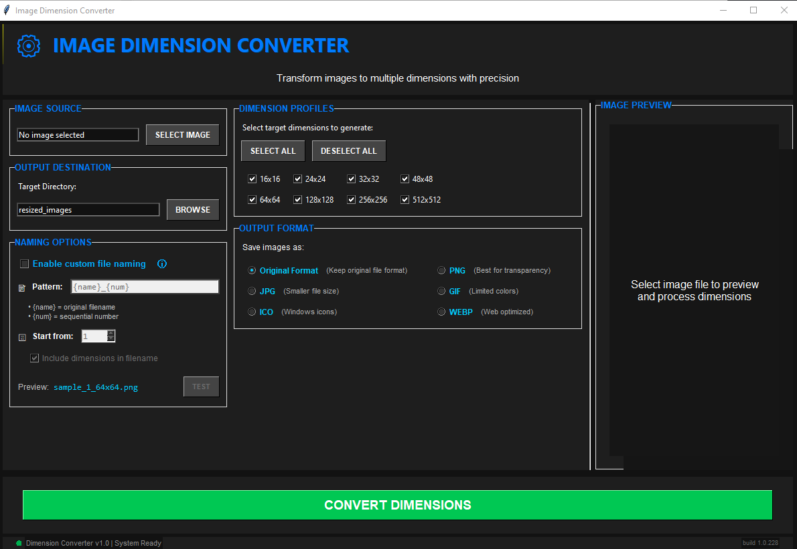

# Image Dimension Converter

A powerful, user-friendly desktop application for converting images to multiple dimensions with advanced customization options.



## Features

- **Multi-dimension Conversion**: Generate multiple sized copies of your images in a single click
- **Custom Naming Options**: Customize output filenames with sequential numbering
- **Multiple Format Support**: Convert to PNG, JPEG, ICO, GIF, or WEBP formats
- **Batch Processing**: Process multiple dimensions simultaneously
- **Real-time Preview**: See your image before conversion
- **Intuitive Interface**: Clean, modern UI with easy navigation

## Installation

### Windows

1. Download the latest release from the [Releases](https://github.com/yourusername/image-dimension-converter/releases) page
2. Extract the ZIP archive to your preferred location
3. Run `Image Dimension Converter.exe`

### From Source

1. Clone the repository:
   ```
   git clone https://github.com/yourusername/image-dimension-converter.git
   ```
2. Install dependencies:
   ```
   pip install pillow
   ```
3. Run the application:
   ```
   python gui.py
   ```

## Usage

1. **Select Image**: Click "SELECT IMAGE" to choose an image file
2. **Choose Output Directory**: Specify where to save resized images
3. **Select Dimensions**: Check the dimensions you want to generate
4. **Custom Naming (Optional)**: Enable custom naming for more control over filenames
5. **Select Output Format (Optional)**: Choose your desired output format
6. **Convert**: Click "CONVERT DIMENSIONS" to process the image

### Custom Naming Pattern

Use these placeholders in your custom naming pattern:
- `{name}`: Original filename
- `{num}`: Sequential number (starts from your specified number)

## Building from Source

To build a standalone executable:

1. Install PyInstaller:
   ```
   pip install pyinstaller
   ```
2. Run the build script:
   ```
   python build.py
   ```

The executable will be created in the `dist/Image Dimension Converter` directory.

## Requirements

- Windows 7/8/10/11
- No additional dependencies required for the executable version

## License

This project is licensed under the MIT License - see the LICENSE file for details.

## Acknowledgments

- Built with Python and Tkinter
- Icon assets created with Pillow 